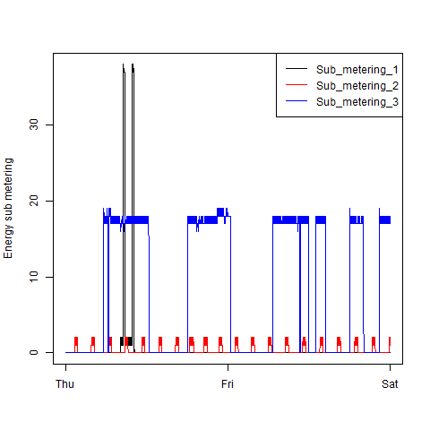
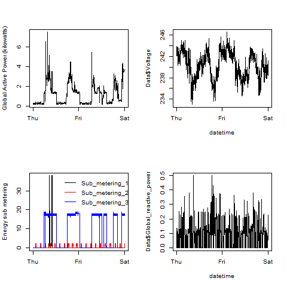

# EDA-Assignment-Week1  

Here's all the plots and the scripts that made them in one place.  
Note that each script starts with:

    Data = read.table("household_power_consumption.txt", header = TRUE, sep = ";", colClasses = c("character", "character", "double", "double", "double", "double", "double", "double", "double"), na.strings = "?")
    Data$Time = strptime(paste(Data$Date, Data$Time), "%d/%m/%Y %H:%M:%S")
    Data$Date = as.Date(Data$Date, "%d/%m/%Y")
    Data = (subset(Data, Date >= as.Date("01/02/2007", "%d/%m/%Y") & Date <= as.Date("02/02/2007", "%d/%m/%Y")))

and ends with:  

    dev.copy(png, file = "plot1.png") #change the 1 out with the respective plot #
    dev.off()
But isn't included from here on to save on wasted space since it's almost exactly the same each time.  

**Plot 1:**  
  
  
  
    hist(Data$Global_active_power, col = "red", xlab = "Global Active Power (kilowatts)", main = "Global Active Power")
  
**Plot 2:**  

  

    plot(Data$Time, Data$Global_active_power, type = "l", xlab = "", ylab = "Global Active Power (kilowatts)")

**Plot 3:**  

  

    with(Data, plot(Time, Sub_metering_1, type = "l", xlab = "", ylab = "Energy sub metering"))
    with(Data, lines(Time, Sub_metering_2, col = "red"))
    with(Data, lines(Time, Sub_metering_3, col = "blue"))
    legend("topright", lty = 1, col = c("black", "red", "blue"), legend = c("Sub_metering_1", "Sub_metering_2", "Sub_metering_3"))

**Plot 4:**  

  

    par (mfrow = c(2,2))
    
    plot(Data$Time, Data$Global_active_power, type = "l", xlab = "", ylab = "Global Active Power (kilowatts)")
    
    plot(Data$Time, Data$Voltage, type = "l", xlab = "datetime")
    
    with(Data,{ 
    plot(Time, Sub_metering_1, type = "l", xlab = "", ylab = "Energy sub metering")
    lines(Time, Sub_metering_2, col = "red")
    lines(Time, Sub_metering_3, col = "blue")
    legend("topright", lty = 1, bty = "n",  col = c("black", "red", "blue"), legend = c("Sub_metering_1", "Sub_metering_2", "Sub_metering_3"))
    })
    
    plot(Data$Time, Data$Global_reactive_power, type = "l", xlab = "datetime")

